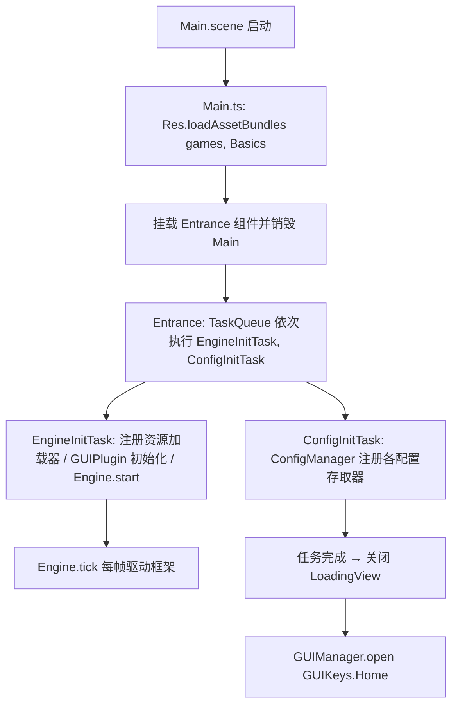
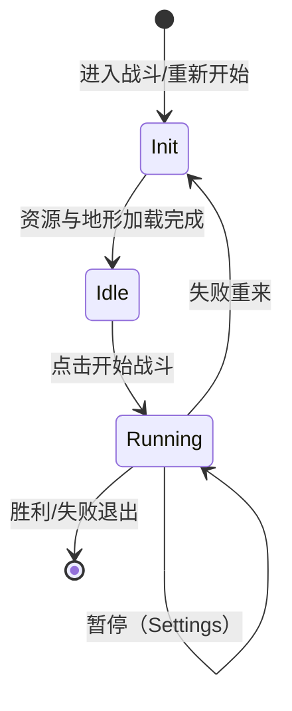
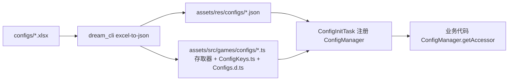

# Client3 技术文档

> 项目：Client3 —— 一款 Kingdom Rush 风格的塔防游戏客户端
> 引擎：Cocos Creator 3.8.8（TypeScript，`strict: false`）
> 框架：dream-cc（core / gui / ecs / ai / pathfinding）+ FairyGUI（fairygui-cc）
> 仓库根目录：`D:\DreamCC`（本工程位于 `clients/Client3`）
> 最后提交：2025-03-30（`587e496`），当前工作区存在未提交的 WIP 改动

---

## 1. 项目概述

Client3 是 dream-cc 体系下的一个塔防游戏客户端，玩法对标《王国保卫战》：

- 主菜单选择/新建存档（多存档位）；
- 大地图选择关卡，关卡旗子随通关进度变化（红/蓝/白旗、星级、英雄/钢铁模式）；
- 关卡选择界面展示模式（战役/英雄/钢铁）、难度、星级、禁用塔、挑战规则；
- 战斗界面为完整塔防玩法：按波次刷怪、怪物沿路寻路、塔点建造、失败/胜利结算；
- 设置界面调整音量、难度、暂停/退出/重开。

游戏逻辑与表现分离：

- UI 全部由 FairyGUI 制作（源工程在 `D:\DreamCC\ui_project`），打包成 `.bin` + 图集资源；
- 玩法逻辑使用 dream-cc 的 ECS（战斗实体）、AI（状态机 FSM）、寻路（DDLS）、GUI（GUIMediator 体系）；
- 配置数据由 Excel 源（`D:\DreamCC\configs`）经 Rust 工具 `dream_cli` 导出为 JSON 与 TypeScript 存取器。

## 2. 技术栈

| 类别 | 技术 | 说明 |
| --- | --- | --- |
| 引擎 | Cocos Creator 3.8.8 | 2D 游戏，设计分辨率 1920x1080 |
| 语言 | TypeScript | `tsconfig` 中 `strict: false` |
| UI | FairyGUI（fairygui-cc） | 通过 `ui/*.bin` 运行时加载 |
| 框架 | dream-cc-core | 引擎、资源 Res、配置、模块、事件、序列化、I18N、音频 |
| 框架 | dream-cc-gui | GUIManager / GUIMediator / GUIPlugin |
| 框架 | dream-cc-ecs | ECSWorld / LevelManager / 组件与系统 |
| 框架 | dream-cc-ai | FSM 状态机 / 行为树（当前主要使用 FSM） |
| 框架 | dream-cc-pathfinding | DDLS 网格寻路（DDLSMesh / DDLSPathFinder / Polygon） |
| 配置工具 | dream_cli（Rust） | Excel → JSON + TS 存取器、模型 → EXI 接口 |
| 编辑器扩展 | dream-cc-plugin | GUI 配置/代码生成面板、Excel 导出面板、项目初始化 |

框架以本地成品形式放在 `assets/libs/`（`.mjs` + `.d.ts`），通过 `import-map.json` 与 `tsconfig.json` 的 `paths` 引用：

```json
{
  "imports": {
    "dream-cc-core": "./assets/libs/dream-cc-core.mjs",
    "fairygui-cc": "./assets/libs/fairygui-cc.mjs",
    "dream-cc-gui": "./assets/libs/dream-cc-gui.mjs",
    "dream-cc-ecs": "./assets/libs/dream-cc-ecs.mjs",
    "dream-cc-pathfinding": "./assets/libs/dream-cc-pathfinding.mjs",
    "dream-cc-ai": "./assets/libs/dream-cc-ai.mjs"
  }
}
```

框架源码在 `D:\DreamCC\dream-cc\`（core / ecs / gui / ai / pathfinding / fgui-dream-cc）。修改框架后需要构建出成品再同步到 `assets/libs/`。

## 3. 仓库结构

```
D:\DreamCC\                       # git 仓库根
├─ clients\Client3\               # ★ 本工程（Cocos Creator 项目）
│  ├─ assets\
│  │  ├─ loadingViews\            # 启动场景 Main.scene / Main.ts / LoadingViewImpl.ts
│  │  ├─ libs\                    # dream-cc + fairygui 成品库（.mjs/.d.ts）
│  │  ├─ res\                     # res 包：configs / sounds / images / battles
│  │  ├─ resources\               # 常规 resources 目录
│  │  └─ src\
│  │     ├─ games\                # 入口、常量、配置、枚举、资源加载器
│  │     ├─ models\               # 存档模型（playerPrefs）
│  │     ├─ models_exi\           # 工具生成的模型接口（EXI_*.ts）
│  │     └─ modules\              # UI 业务模块（每个模块一个 AssetBundle）
│  ├─ extensions\dream-cc-plugin\ # Cocos Creator 编辑器扩展
│  ├─ settings\                   # 编辑器设置（设计分辨率等）
│  ├─ profiles\                   # 扩展持久化配置
│  ├─ build_excel.bat             # Excel 配置导出
│  ├─ build_exi.bat               # 数据模型接口导出
│  ├─ import-map.json             # ESM 导入映射
│  └─ tsconfig.json
├─ configs\                       # Excel 配置源（attrs/constants/language/level/maps/monster/skills/tower）
├─ dream-cc\                      # 框架源码库
├─ tools\                         # dream_cli / dream-cc-plugin / cc_module_check
└─ ui_project\                    # FairyGUI 编辑器工程（UI 源文件）
```

### 客户端代码目录速查

| 目录 | 内容 |
| --- | --- |
| `assets/src/games/Entrance.ts` | 启动入口（任务队列 + 引擎初始化） |
| `assets/src/games/consts/` | `GUIKeys.ts`、`LayerKeys.ts` |
| `assets/src/games/configs/` | 配置存取器 + `ConfigKeys.ts` + 生成的 `Configs.d.ts` |
| `assets/src/games/enums/` | `GameDifficulty.ts`、`GameMode.ts` |
| `assets/src/games/inits/` | `EngineInitTask.ts`、`ConfigInitTask.ts` |
| `assets/src/games/res/` | 自定义资源加载器（ani 动画、tower 皮肤） |
| `assets/src/models/playerPrefs/` | 存档数据模块 |
| `assets/src/models_exi/` | 工具生成的模型接口（勿手改） |
| `assets/src/modules/<Name>/` | UI 模块：`<Name>Binder.ts`（勿手改）、`<Name>Mediator.ts`、`ui/` |
| `assets/src/modules/Battle/` | 战斗模块（fsm / ecs / levels / inits / datas / actions） |

## 4. 运行与调试

1. 用 Cocos Creator 3.8.8 打开 `D:\DreamCC\clients\Client3`（项目级 `package.json` 标记 `creator.version = 3.8.8`）；
2. 首次打开后需要让编辑器导入资源（生成 `library/`、`temp/`）；
3. 启动场景为 `assets/loadingViews/Main.scene`（已在场景设置中标记为当前场景）；
4. 浏览器预览后，VS Code 中可用 `launch.json` 配置的 Chrome 调试 `http://localhost:7456`；
5. 资源改动后可执行 VS Code 任务 `Cocos Creator compile`（等价 `curl http://localhost:7456/asset-db/refresh`）刷新资源库。

> 注意：`library/`、`temp/`、`profiles/`、`build/` 均被 `.gitignore` 忽略，属于编辑器生成物。

## 5. 启动流程



细节：

- `Main.ts` 只负责加载 `games` 与 `Basics` 两个 AssetBundle，然后挂载 `Entrance`；
- `Entrance.ts` 用 `TaskQueue` 顺序执行 `EngineInitTask` 与 `ConfigInitTask`，进度通过 `LoadingView.changeData({progress})` 显示；完成回调中打开主界面；
- `EngineInitTask` 中：
  - 配置 `Res.sheet2URL` / `Res.url2Sheet`，把配置表名映射到 `configs/` 目录；
  - 注册自定义加载器：`ani` → `UnitAnimationLoader`、`tower` → `TowerSkinLoader`；
  - 初始化 `GUIPlugin`：传入 `guiconfig.json`、层级顺序、以及初始加载的 UI 包（Basics、Home）与语言表；
- `ConfigInitTask` 注册的配置表（与 `ConfigKeys` 对应）：

| 键 | 存取器 |
| --- | --- |
| `attrs/Attributes` | `IDConfigAccessor` |
| `constants/Constants` | `ConstantAccessor` |
| `level/Level` | `LevelAccessor` |
| `maps/MapPath` | `MapPathAccessor` |
| `monster/Monster` | `IDConfigAccessor` |
| `skills/Skill` | `SkillAccessor` |
| `tower/Tower` | `TowerAccessor` |

> 注意：`ConfigKeys.Skills_PassiveSkill`（`skills/PassiveSkill`）尚未在 `ConfigInitTask` 中注册，当前未被使用。

## 6. GUI 系统

### 6.1 架构

GUI 由 dream-cc-gui 管理，与 FairyGUI 深度绑定：

- `GUIManager.open(key, data)` 按 `guiconfig.json` 中的配置加载对应 AssetBundle 与 FairyGUI 包，创建 UI；
- 每个 UI 配置对应一个 `IViewCreator`（组件挂在 Cocos 场景中，通常随模块脚本一起部署），`createMediator()` 返回业务 Mediator；
- `GUIMediator` 声明依赖：`configs`（配置表）、`assets`（资源）、`modules`（数据模块），框架自动加载后回调 `init/show`；
- `SubGUIMediator` 用于拆分单个界面的子逻辑（例如 Map 的拖动与关卡旗子）。

### 6.2 guiconfig.json

位于 `assets/res/configs/guiconfig.json`，每条配置字段：

| 字段 | 含义 | 示例 |
| --- | --- | --- |
| `key` | UI 标识，对应 `GUIKeys` 枚举值 | `"Home"` |
| `layer` | 所属层级（`LayerKeys`） | `"FullScreen"` / `"Window"` |
| `modal` / `modalClose` | 是否模态、点击遮罩是否关闭 | `false` |
| `permanence` | 是否常驻 | `true` |
| `bundleName` | 资源所在的 AssetBundle | `"Home"` |
| `packageName` | FairyGUI 包名 | `"Home"` |
| `comName` | 包内组件名 | `"Home"` / `"UI_Map"` |

当前注册的 UI：

| key | 层级 | bundle | 组件 | Mediator |
| --- | --- | --- | --- | --- |
| Home | FullScreen | Home | Home | HomeMediator |
| Map | FullScreen | Map | UI_Map | MapMediator |
| LevelSelect | Window | LevelSelect | UI_LevelSelectWindow | LevelSelectMediator |
| Battle | FullScreen | Battle | UI_BattleView | BattleMediator |
| Settings | Window | Settings | UI_SettingsWindow | SettingsMediator |
| Defeated | Window | Battle | UI_DefeatedWindow | DefeatedMediator |
| Settlement | Window | Battle | UI_SettlementWindow | SettlementMediator |

### 6.3 层级（LayerKeys）

`FullScreen > Window > Pannel > Tooltip > Alert > Guide` 等；`BattleDamage` 用于战斗伤害显示层。GUIPlugin 初始化时按 `layers` 数组顺序创建。

### 6.4 Mediator 模板

每个模块固定由三部分组成（参考 `extensions/dream-cc-plugin/static/template/MediatorTemplate.txt`）：

1. **Binder（生成文件，勿手改）**：FairyGUI 代码生成，如 `HomeBinder.ts`，包含 `UI_*` 组件类与 `bindAll()`；
2. **ViewCreator**：默认导出 `@ccclass('XxxViewCreator')` 组件，实现 `IViewCreator.createMediator()`，内部调用 `Binder.bindAll()` 并返回 Mediator；
3. **Mediator**：继承 `GUIMediator`，生命周期 `init → show(data) → showedUpdate(data) → hide → destroy`，可重写 `tick(dt)`。

## 7. 模块说明

### 7.1 Home（主菜单）

- 展示存档列表（`GList` 复用 `UI_NewGame` / `UI_SlotButton`），新游戏/读取/删除存档；
- 播放 logo 动画与主菜单音乐；
- 依赖 `ModuleKeys.Playerprefs`；点击"选项"打开 `GUIKeys.Settings`。

### 7.2 Map（大地图）

- `DragMeditor`：地图拖拽（限制在视口范围内）；
- `FlagsMeditor`：关卡旗子逻辑，负责：
  - 遍历 `LevelAccessor.maxLevel` 渲染旗子（未解锁隐藏）；
  - 通关后（`VictoryData`）播放插旗/升蓝/升白/星级动画，计算解锁关卡并保存；
  - 通过 `MapPathAccessor` 播放关卡间路径动画；
  - `DEBUG` 下支持键盘作弊：`L` 切关卡、`D` 切难度、`M` 切模式、`S` 切星级；
- 点击旗子 → `GUIKeys.LevelSelect`，传入关卡 ID。

### 7.3 LevelSelect（关卡选择）

- 展示关卡名（I18N）、缩略图、星级、已通关难度、挑战规则（塔最大等级、禁用英雄、禁用塔）；
- 三模式（战役/英雄/钢铁）通过 `m_c1` 控制器切换，三难度循环选择并持久化到 `playerPrefs`；
- 点击开战 → 关闭自身并 `GUIManager.open(GUIKeys.Battle, {level, difficulty, mode})`。

### 7.4 Battle（战斗，核心玩法）

见第 8 节。

### 7.5 Settings（设置）

按调用方传入的 `data.state` 呈现三种形态：

| state | 场景 | 按钮行为 |
| --- | --- | --- |
| 0（无数据） | 主菜单进入 | 返回/退出 |
| 1 | 地图进入 | 返回/退出 |
| 2 | 战斗中暂停 | 继续/退出/重新开始 |

`data.close` 是回调：`0` 返回、`1` 退出、`2` 重开。音量滑杆实时写入 `AudioManager` 并保存。

### 7.6 Defeated / Settlement

- `Defeated`：战斗失败窗口，回调 `0` 重来、`1` 退出；
- `Settlement`：胜利结算，按星级播放星星动画，点击继续 → `GUIManager.open(GUIKeys.Map, VictoryData)`，由 Map 刷新并解锁关卡。

## 8. 战斗系统

### 8.1 整体结构

战斗模块位于 `assets/src/modules/Battle/`：

```
Battle/
├─ BattleMediator.ts        # 界面层：初始化 Level、绑定数据、tick
├─ BattleBinder.ts          # FairyGUI 生成
├─ SettlementMediator.ts    # 胜利结算
├─ DefeatedMediator.ts      # 失败窗口
├─ fsm/                     # 战斗状态机（Init / Idle / Running）
├─ levels/                  # BattleMode、实体枚举、实体工厂
├─ ecs/                     # 自定义组件与系统（显示/移动/血条）
├─ inits/                   # 资源加载任务（通用/地形/波次/塔）
├─ datas/                   # BattleModel 单例、VO、波次数据
├─ actions/                 # 动作键与动作映射
├─ directions/              # 8 方向
└─ utils/Timeline.ts        # 战斗时间轴（暂停感知）
```

### 8.2 状态机（FSM）



- `InitState`：清理世界 → `model.init(data)` → 注册 ECS 系统 → 创建层级实体 → 用 TaskQueue 顺序执行 `LoadCommonTask → LoadTerrainTask → LoadWaveTask → LoadTowerTask`；加载完成后构建背景、导航网格、路径，切换到 Idle；
- `IdleState`：播放战前音乐，创建塔点（`BattleEntityFactory.createTowerPoint`），等待开始按钮；
- `RunningState`：`Timeline.tick` 推进时间，检查波次与提示、生成怪物、胜负判定。

### 8.3 ECS

`BattleMediator.init` 中：

```ts
LevelManager.single.initLevel(LevelKeys.Battle, root2D, 1000);
```

`InitState` 注册的系统（顺序敏感）：

```ts
world.addSystems([
  HPBarSystem,
  PathMovementSystem,
  UintAnimationSystem,
  AddToParentSystem,
  DisplaySystem,
]);
```

层级实体（`BattleEntitys`）：`World` → `StaticLayer` / `StaticEffectLayer` / `DynamicLayer` / `DynamicEffectLayer`（+ DEBUG 下的 `DebugView`）。

自定义组件/系统：

| 文件 | 职责 |
| --- | --- |
| `ecs/movments/PathMovementComponent.ts` | 路径 + 速度 + 目标点 |
| `ecs/movments/PathMovementSystem.ts` | 沿路径逐点移动、8 方向朝向 |
| `ecs/display/UnitAnimationComponent.ts` | 精灵图动画（基于 Timeline、8 方向翻转） |
| `ecs/display/UnitAnimationSystem.ts` | 驱动动画组件 |
| `ecs/states/HPBarComponent.ts` | 血条 Prefab 加载 |
| `ecs/states/HPBarSystem.ts` | 血条数值同步与缩放 |
| `ecs/display/ImageComponent.ts` | 静态图片显示（背景） |
| `ecs/display/TowerPointComponnent.ts` | 塔点配置 |
| `ecs/display/DDLSDebugComponent.ts` | 调试绘制导航网格/路径（DEBUG） |

怪物创建（`BattleEntityFactory.createMonster`）：

- 从 `Monster` 配置表取怪物配置（skin、attr_id、life、gold…）；
- 实体命名 `skin_wave_xx_index_xx_path_xx`；
- 挂载 `UnitAnimationComponent`（播放 walking）、`DataComponent`（`MonsterVO`）、`PathMovementComponent`、`CampComponent`（camp=2 为敌）、`HPBarComponent`；
- 起点取 `paths` 中的第一个点。

### 8.4 寻路与地形

- 地形配置（`battles/levels/<terrains>.json`）包含：`navWidth/navHeight`、`areas`（type=0 障碍约束多边形、type=1 结束区域）、`paths`（命名路径点数组）、`towers`（塔点）、`images`（背景图）；
- `InitState.__initNavigation` 用 `DDLSRectMeshFactory.buildRectangle` 构建网格，把障碍多边形插入为约束形状，创建 `DDLSPathFinder`；
- 怪物不实时寻路，而是沿配置好的 `paths` 走（`PathMovementSystem`）。

### 8.5 波次与刷怪

- 波次配置（`battles/levels/waves/<terrains>_waves_<mode>.json`）：

```json
{
  "time": 10000,        // 波次开始时间（ms）
  "tipTime": 3000,      // 提前提示时间
  "glod": 200,          // 提前开波可获得的金币
  "spawns": [
    { "delay": 0, "interval": 1000, "creep": 1, "path": "path_1_1", "count": 3 }
  ]
}
```

- `RunningState` 累积时间，到点把 `spawns` 展开成 `SpawnData` 队列，到时逐个 `createMonster`；
- 下一波提示期间可提前开波，金币奖励按剩余提示时间比例折算。

### 8.6 胜负判定

- **失败**：怪物进入结束区域（`end.contains(x,y)`）→ 扣 `levelConfig.hp`，生命 ≤ `endLife` 时弹出 `Defeated`；
- **胜利**：所有波次放完且场上/队列无怪物 → 按剩余生命比例 `life/maxlife` 评星（<0.3 一星、<0.6 二星、否则三星）→ 弹出 `Settlement`，继续后回 Map 解锁。

### 8.7 战斗资源加载任务

`InitState` 内的加载顺序与内容：

| 任务 | 内容 |
| --- | --- |
| `LoadCommonTask` | 地形 JSON（levelConfig.terrains）+ 血条 Prefab（green/yellow bar） |
| `LoadTerrainTask` | 背景图 SpriteFrame + 塔点 Prefab（build_terrain_<type>） |
| `LoadWaveTask` | 波次 JSON + 波次内所有怪物的 ani 动画 |
| `LoadTowerTask` | 建造过程图 + 塔皮肤（tower 类型资源） |

所有资源通过 `Res.create(..., "Battle", ...)` 引用，统一登记到 `BattleModel.assets`，`model.clear()` 时释放。

## 9. 资源与自定义加载器

### 9.1 AssetBundle

| Bundle | 内容 |
| --- | --- |
| `res` | 配置 JSON、音频、图片、战斗资源（battles/） |
| `games` | 启动/公共代码与初始化相关资源（优先级 7） |
| `Basics` | 公共 UI 包 |
| `Home` / `Map` / `LevelSelect` / `Battle` / `Settings` | 各模块 UI 包 |

### 9.2 GamePath

统一资源 URL 构造器（`assets/src/games/GamePath.ts`）：`soundURL`、`sheetURL`、`imageURL`、`battleURL`。

### 9.3 自定义加载器

通过 `Res.setLoader(key, Loader)` 注册，加载器实现 `ILoader`：

- **`ani` → `UnitAnimationLoader`**：加载动画 JSON（`actions` + `textures` 图集列表）→ 并行加载 SpriteAtlas → 构建 `UnitAnimationAsset` 注册进 `ResourceManager`；`UnitAnimationAsset` 按 `action.prefix + "_" + 四位数帧号` 从图集取帧；
- **`tower` → `TowerSkinLoader`**：加载皮肤 JSON（元素数组：`image` / `ani` 两种类型）→ 加载对应 SpriteFrame / ani → 构建 `TowerSkinAsset`。

## 10. 配置系统

### 10.1 数据流水线



`build_excel.bat`：

```bat
set dream_exe="D:\DreamCC\tools\dream_cli\target\release\dream_cli.exe"
set input_dir=D:\DreamCC\configs
set output_dir=D:\DreamCC\clients\Client3\assets\res\configs
set code_output_path=D:\DreamCC\clients\Client3\assets\src\games\configs
%dream_exe% excel-to-json -i %input_dir% -o %output_dir% -c %code_output_path% -v 2 -w 1 -x 3 -y 4 -z ,
```

参数说明（来自 `dream_cli/src/excels/excel2json.rs`）：

| 参数 | 含义 |
| --- | --- |
| `-i` | Excel 目录（输入） |
| `-o` | JSON 输出目录 |
| `-c` | 代码输出目录（存取器/枚举/类型声明） |
| `-v` | 标题行索引 |
| `-w` | 类型行索引 |
| `-x` | 注释行索引 |
| `-y` | 数据起始行索引 |
| `-z` | 数组分隔符（当前为 `,`） |
| `-a` / `-b` | 是否导出代码 / 配置（默认 true） |

### 10.2 生成产物

- `assets/res/configs/*.json`：运行时配置数据；
- `assets/src/games/configs/ConfigKeys.ts`：配置键枚举（**生成，勿手改**，由工具维护）；
- `assets/src/games/configs/Configs.d.ts`：`namespace Config` 类型声明（**生成，勿手改**）；
- `assets/src/games/configs/*Accessor.ts`：业务存取器（**手写业务扩展 + 工具生成混合**，例如 `LevelAccessor` 手写 `getLevel` 与 `maxLevel`）。

> 注意：`ConfigKeys.ts` 与 `Configs.d.ts` 由工具生成，但 `*Accessor.ts` 中的业务方法需手写；重新导出配置后需人工核对存取器未被覆盖。

### 10.3 现有配置表

| 表 | 键 | 主要字段 |
| --- | --- | --- |
| Attributes | attrs/Attributes | id、hp、hp_recovery、mp、mp_recovery、speed、armors |
| Constants | constants/Constants | key、value、list、str_list |
| Language | language/zh_CN | id、value（I18N） |
| Level | level/Level | id、terrains、difficulty、mode、hp、glod、disabledTowerType、towerMaxLevel、disableHero、unlocks、endLife |
| MapPath | maps/MapPath | level、pathAni |
| Monster | monster/Monster | id、skin、bounds、head_position、anchor、hp_bar、hp_scale、size、attr_id、life、skills、gold |
| Skill | skills/Skill | type、level、mainType、name、icon、desc、activeType、cd、startAnimation、startEffect、targetType、attackRange |
| PassiveSkill | skills/PassiveSkill | id、name、icon、type、triggerCondition、triggerArgs、trigger、cmd、cmdArgs、trapID、buffers、desc（未注册使用） |
| Tower | tower/Tower | id、type、level、glod、upList、building、icon、attack、skill |

## 11. 存档系统

### 11.1 结构

- `assets/src/models/playerPrefs/`：手写模型：
  - `Module_playerPrefs`：dream-cc `Module`，负责读取/保存（`localStorage` + `DictionaryProperty` 序列化）；
  - `PlayerRecord`、`GameRecord`、`LevelRecord`：早期的手写记录类（部分逻辑已被 Module 版本取代）；
  - `RecordPropertys`：字段键枚举（`index/volume/music_volume/sound_volume/difficulty/games/levels/stars`）；
- `assets/src/models_exi/EXI_Playerprefs.ts`：`build_exi.bat` 生成的接口（`EXI_Playerprefs.Module_playerPrefs` 等），业务代码以该接口类型访问模块。

### 11.2 序列化

`Module_playerPrefs` 使用 dream-cc 的属性体系（`DictionaryProperty` / `ArrayProperty` / `NumberProperty`）：

```ts
read(): void {
  let str = localStorage.getItem(this.gameName);
  if (!str) this.__createDefaultRecord();
  else this.playerRecord.decode(SerDesMode.JSON, JSON.parse(str));
}

save(): void {
  let json = this.playerRecord.encode(SerDesMode.JSON);
  localStorage.setItem(this.gameName, JSON.stringify(json));
}
```

本地存储键为 `greg_td_game`（`gameName` 字段）。

### 11.3 关卡记录

每个存档包含 `levels` 字典，按关卡 ID 记录：`stars`、`0/1/2`（战役/英雄/钢铁模式）各自的通关难度；`openToLevel(level)` 用于解锁路径。

## 12. 编辑器扩展（dream-cc-plugin）

位于 `extensions/dream-cc-plugin/`，版本 1.0.3，支持 Cocos Creator ≥ 3.7：

| 面板/菜单 | 功能 |
| --- | --- |
| GUI 面板 | 维护 `guiconfig.json`、生成/同步 `GUIKeys.ts`、`LayerKeys.ts`、Mediator 模板 |
| Excel 面板 | 可视化配置导出（代码在 `dist/panels/excel`） |
| 初始化项目 | 创建 `assets/res`、`configs`、`guiconfig.json`、`GUIKeys.ts` 等 |
| 清除设置 | 清空扩展在编辑器的持久化配置 |

扩展持久化配置（`profiles/v2/packages/dream-cc-plugin.gui.json`）指向：

```json
{
  "guiconfigFile": "…/assets/res/configs/guiconfig.json",
  "guiEnumFile": "…/assets/src/games/consts/GUIKeys.ts",
  "layerEnumFile": "…/assets/src/games/consts/LayerKeys.ts",
  "modulesPath": "…/assets/src/modules"
}
```

扩展源码在 `src/`（TypeScript，`npm run build` 编译到 `dist/`）。

## 13. 数据格式说明

### 13.1 地形 JSON（`battles/levels/<terrains>.json`）

```json
{
  "navWidth": 300,
  "navHeight": 300,
  "width": 1920,
  "height": 1080,
  "towers": [{ "id": "tp_1", "type": 1, "x": 100, "y": 200 }],
  "paths": { "path_1_0": [x1, y1, x2, y2, ...] },
  "areas": [{ "type": 0, "points": [x1,y1,x2,y2,...] }],
  "images": [{ "x": 0, "y": 0, "image": "go_stage01_bg-1.png" }]
}
```

### 13.2 动画 JSON（ani）

```json
{
  "actions": [
    { "key": "walking", "prefix": "goblin_0_walking", "from": 0, "to": 7, "loop": true, "events": [] }
  ],
  "textures": ["goblin_0.png"]
}
```

### 13.3 塔皮肤 JSON（tower）

```json
[
  { "name": "body", "type": "image", "url": "body.png", "ax": 0.5, "ay": 0.5, "x": 0, "y": 0 },
  { "name": "ani", "type": "ani", "url": "tower_archer_lvl1_shooter_0.plist", "ax": 0.5, "ay": 0.5, "x": 0, "y": 0 }
]
```

## 14. 工程约定

1. **生成文件勿手改**：`*Binder.ts`、`assets/src/models_exi/*`、`assets/src/games/configs/ConfigKeys.ts`、`Configs.d.ts`，通过工具或 FairyGUI 重新生成；
2. 源码文件为 **UTF-8 无 BOM**，注释用中文；
3. 私有方法以 `__` 前缀命名（如 `__startButtonClick`）；
4. 新 UI 必须走 Mediator + ViewCreator + Binder 模式，并在 `guiconfig.json` / `GUIKeys.ts` 注册；
5. 新配置表必须走 Excel → dream_cli → `ConfigKeys` → `ConfigInitTask` 注册 → `ConfigManager.getAccessor` 使用的完整链路；
6. 战斗内时间相关逻辑（动画、波次）使用 `Timeline.single`（暂停感知），避免直接用 `dt` 累计；
7. 资源请求 `ResRequest` 使用完毕要 `dispose()`，并登记到所属 Model 统一释放（参考 `BattleModel.assets`）；
8. 修改 `assets/libs/` 下框架成品时，需同步修改 `D:\DreamCC\dream-cc\` 下源码并重新构建分发。

## 15. 已知问题与 TODO

来自代码注释与当前状态：

- `LoadWaveTask` / `LoadTowerTask` 中有 `TODO 怪物/塔技能相关资源未加载`；
- `PlayerRecord.save()` 中存在空循环（`for... elements` 无实际操作），该手写类已基本被 `Module_playerPrefs` 取代；
- `ConfigKeys.Skills_PassiveSkill` 已声明但未注册、未使用；
- `MonsterAccessor.ts` 目前为空（`export {}`），怪物表通过 `IDConfigAccessor` 访问；
- 战斗塔的建造/升级/技能/英雄系统尚未实现（当前只有塔点、怪物寻路、波次、胜负与存档）；
- `MapMediator` 打开设置传 `state:1`，`BattleMediator` 传 `state:2`，Home 无状态；
- 工作区存在大量未提交 WIP（详见 `AI_DEV_GUIDE.md` 第 9 节），新改动前请先确认基线。

## 16. 关键文件索引

| 用途 | 文件 |
| --- | --- |
| 启动 | `assets/loadingViews/Main.ts`、`assets/src/games/Entrance.ts` |
| 引擎/配置初始化 | `assets/src/games/inits/EngineInitTask.ts`、`ConfigInitTask.ts` |
| UI 配置 | `assets/res/configs/guiconfig.json` |
| UI 常量 | `assets/src/games/consts/GUIKeys.ts`、`LayerKeys.ts` |
| 资源路径 | `assets/src/games/GamePath.ts` |
| 配置存取器 | `assets/src/games/configs/*Accessor.ts`、`ConfigKeys.ts`、`Configs.d.ts` |
| 战斗模型 | `assets/src/modules/Battle/datas/BattleModel.ts` |
| 战斗模式/FSM | `assets/src/modules/Battle/levels/BattleMode.ts`、`fsm/` |
| 实体工厂 | `assets/src/modules/Battle/levels/BattleEntityFactory.ts` |
| 存档模块 | `assets/src/models/playerPrefs/Module_playerPrefs.ts` |
| 存档接口（生成） | `assets/src/models_exi/EXI_Playerprefs.ts` |
| 自定义加载器 | `assets/src/games/res/UnitAnimationLoader.ts`、`TowerSkinLoader.ts` |
| 工具链 | `D:\DreamCC\tools\dream_cli`、`extensions/dream-cc-plugin` |
| 框架源码 | `D:\DreamCC\dream-cc\` |
